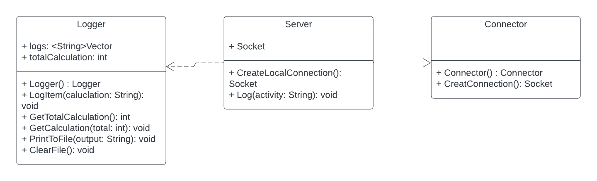

# Calculator
Calculator System with server and client architecture for SE-311 at Drexel University

## Author
Cole Hoener
colehoener@gmail.com or cth59@drexel.edu

## UML Class Diagram (Client)

    
 

 
 ## UML Class Diagram (Server)

    
 

## Instructions

1. Open both the projects in IntelliJ IDE and run the server code first, THEN the client code.
2. Use the calculator as normal.
3. Calculations are printed to the file '**Calculations.txt**'
4. Total calculations are displayed in the console of the server.

## Important Files
1. **Calculations.txt** : This file is cleared and the results of the last system process are written to this file. All calculations are written to this file each time the server is recieves a calculation.

## Known Bugs
Currently, when you close the client down, the server recieves constant null messages which should not happen.

## Notes
1. Server is not multithreaded, but tht can be expanded on in future versions.
 

*This project may not be copied and used for any graded submission under a new name. All code must be cited to Cole Hoener.*

